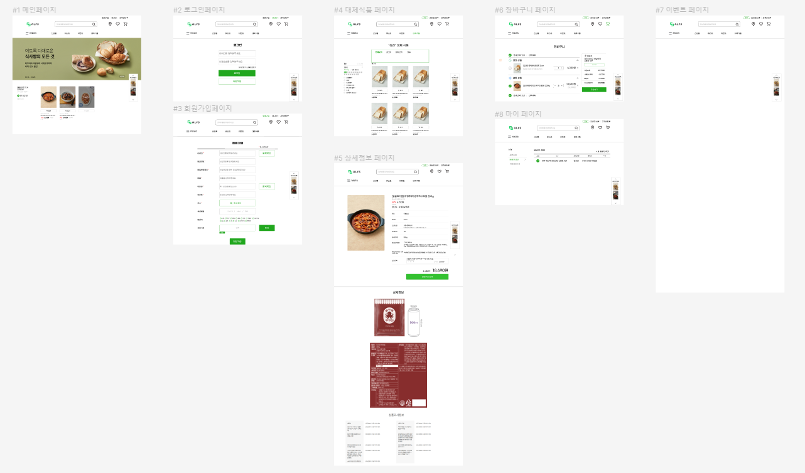
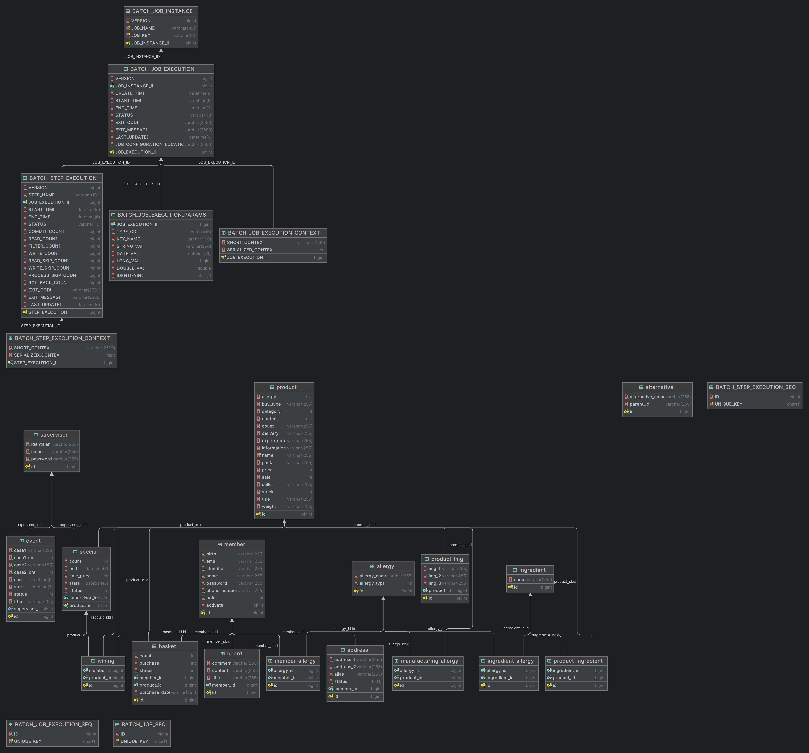

# ALFS

# 알러지 정보 기반의 온라인 식료품 쇼핑 플랫폼

### 배포 주소

> 📌 https://k9c204.p.ssafy.io

# 📌서비스 소개

## 서비스 설명

### 개요

- **타겟층**
    
    <aside>
    💡 매번 원재료를 확인하고 구매해야하는 알러지 환자들
    
    </aside>
    
- **목표**
    
    <aside>
    💡 본인의 알러지를 등록하면 알러지가 **목록**에서부터 필터링 된 서비스를 이용할 수 있는 알러지 환자들에게 새로운 패러다임의 식품 쇼핑을 제공
    
    </aside>
    

# 📌기획 배경

- 알러지를 보유한 경우에 두드러기나 습진 같은 피부 증상, 설사나 구토 등의 소화기 증상 그리고 호흡곤란, 발열 등의 증상이 나타날 수 있는데, 심한 경우 의식을 잃는 아나필락시스 쇼크 증상이 나타나 생명을 위협한다.
- 1인가구의 등장과 비대면의 시대로 온라인 식료품 구매가 활발해지고있다. 알러지 환자들은 어김없이 식재료를 구매하는 것에 불편함을 온라인 식품 쇼핑에서도 겪고 있다.
    
    

# 📌기능 소개

## 주요 기능

⭐ 알러지 필터링

⭐ 대체 식품 추천

⭐ 관리자 상품 등록

⭐ 선착순 특가 및 양자택일 이벤트

# 📌프로젝트 진행 및 산출물

### 프로젝트 개발 기간

2023.10.09 ~ 2023.11.17

### 프로젝트 산출물

### 1. Figma

### 2. ERD

# 📌개발 멤버

## 개발팀 소개

| 연주원 | 김수진 | 손효민 | 신대혁 | 안종상 | 홍주영 |
| --- | --- | --- | --- | --- | --- |
| [joo1yeon](https://github.com/joo1yeon) | [soo0300](https://github.com/soo0300) | [SonHyoMin00](https://github.com/SonHyoMin00) |  |  |  |
| 팀장, Back-end, Infra, 기획 발표 | Back-end | Back-end | Front-end, 최종 발표 | Full-stack | Front-end |