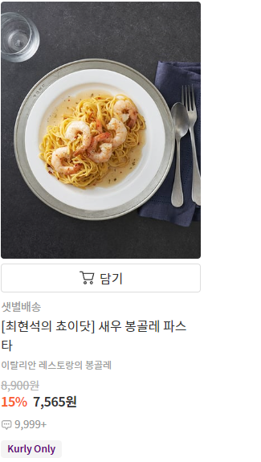
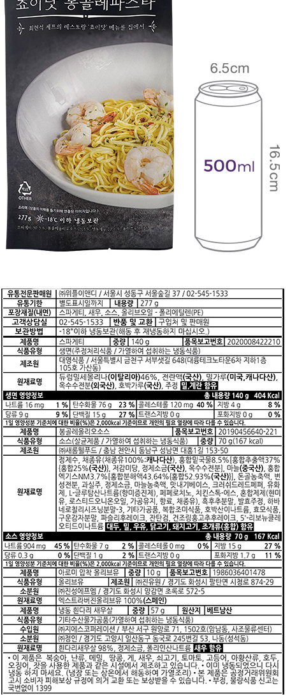

**`[커밋 컨벤션입니다.]`**

- **✨feat: 새로운 기능을 추가할 경우**
- **🌈style: 기능에 영향을 주지 않는 commit, 코드 순서, CSS등의 포맷에 관한 commit**
- **🚨fix: 버그 수정**
- **📌refactor: 코드 refactoring**
- **⚡patch: 요청 사항 반영, 기능 개선**
- **✏test: 테스트 코드 작성**
- 🔍 **merge**: **develop 머지 충돌시 수정후 커밋**
- **📝docs: main 문서를 수정한 경우, 파일 삭제, 파일 명 수정 등**
- **🏗️build: Build 수정**
- **💿backup: 백업**

## Kurly 정보 싹다 털기
* Kurly는 동적 페이지라서, BeautifulSoup이 아닌 Selenium으로 해야합니다.
* WebDriver 라는 것이 필요한데, 크롬 대신에 안쓰는 Edge로 했습니다.
* 필요한 정보들
    
    
* JSON으로 정리한다면,
```javascript
    // Item_List.json
    [
        {
            id : String,
            name : String,
            image : String, // images/main_img
            title : String,
            price : int,
            sale : int,
            delivery : Stirng, // 배송 정보에서 안내사항은 제외
        },
        {
            ...
        },
        ...
    ]
    
    // Item_Details.json
    [
        {
            id : String,
            name : String,
            title : String,
            price : int,
            sale : int,
            images : [
                main_img : String,
                description_img : String,
                ingredient_img : String
            ],
            delivery : String,
            seller : String,
            package : String,
            count : int,
            weight : int,
            allergy : String,
            expiry_date : String,
            information : String,
            buy_type : String,
            stock : int,
            content : String
        },
        {
            ...
        },
        ...
    ]
```
* ItemID_Extract는 상품명과 상품ID를 가져온다.
    * 가져온 상품ID로 상품 상세조회를 한다.

* 이미지 분류
    * 상품 목록 이미지 (main_img)
        

    * 상품 설명 이미지 (description_img)
        

    * 상품 원재료명 이미지 (ingredient_img)
        